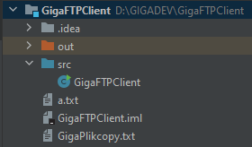
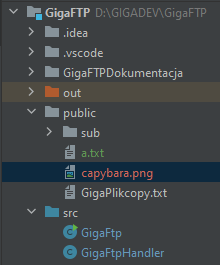
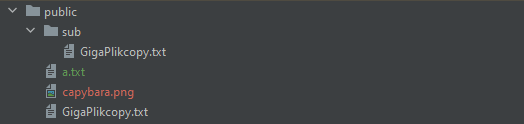
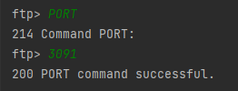
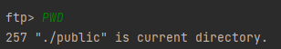
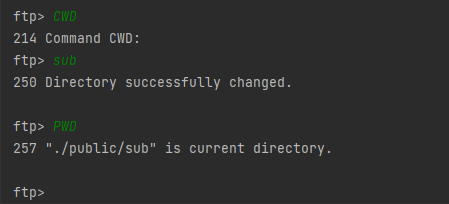
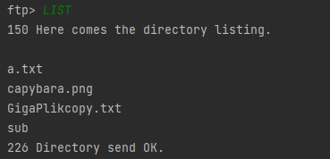
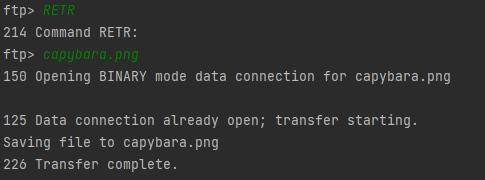
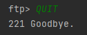

#  GigaFtp - Example Java FTP like server

### Requirements
<ul>
	<li>Java: 8</li>
</ul>

### Project files
#### Client

#### Server

### Available commands
<ul>
	<li>USER</li>
	<li>PASS</li>
	<li>PORT</li>
	<li>QUIT</li>
	<li>RMD</li>
	<li>MKD</li>
	<li>DELE</li>
	<li>RETR</li>
	<li>STOR with ABOR</li>
	<li>CDUP</li>
	<li>CWD</li>
	<li>PWD</li>
	<li>LIST</li>
</ul>

	
### Default FTP user and password

User: user
Password: 1234

All users with passwords are loaded from user.config file

### Example usage:  Server
Run GigaFTP
All files and subfolders in "public" folder of the server will be hosted

### Example usage:  Client

#### Connecting
Run GigaFTPClient and perform authorization steps:

Type USER and wait for response,
Then type username "user":
![[Pasted image 20220617131921.png)

Type PASS and wait for response,
Then type password "1234":

Type PORT and wait for response,
Then set Active Mode for port "3020":

#### FTP Commands example

Now you can retrieve files correctly, you can use supported commands for example:

PWD:

CWD:

LIST:

RETR:

QUIT:

